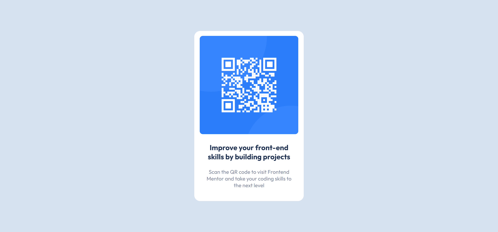
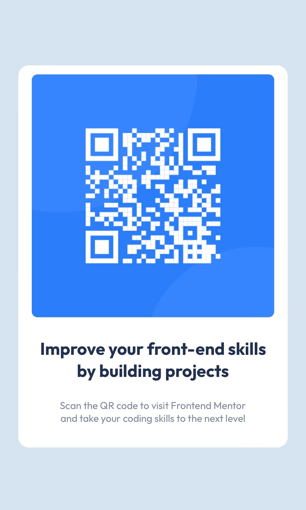

# Frontend Mentor - QR code component solution

This is a solution to the [QR code component challenge on Frontend Mentor](https://www.frontendmentor.io/challenges/qr-code-component-iux_sIO_H). Frontend Mentor challenges help you improve your coding skills by building realistic projects. 

## Table of contents

- [Overview](#overview)
  - [Screenshot](#screenshot)
  - [Links](#links)
- [My process](#my-process)
  - [Built with](#built-with)
  - [What I learned](#what-i-learned)
  - [Continued development](#continued-development)
  - [Useful resources](#useful-resources)
- [Author](#author)

<!-- **Note: Delete this note and update the table of contents based on what sections you keep.** -->

## Overview

### Screenshot




This is screenshots of what I have done according to the challenge, following its guided styles and given elements. The first image illustrates the desktop view while the second image shows the view on mobile.


### Links

- Solution URL: [GitHub Repository](https://github.com/danduong17/qr-code-component-page)
- Live Site URL: [GitHub Page](https://your-live-site-url.com)

## My process

### Built with

- Semantic HTML5 markup
- CSS custom properties
<!-- - Mobile-first workflow
- [React](https://reactjs.org/) - JS library
- [Next.js](https://nextjs.org/) - React framework
- [Styled Components](https://styled-components.com/) - For styles -->

<!-- **Note: These are just examples. Delete this note and replace the list above with your own choices** -->

### What I learned

This challenge has helped me to review basic HTML and CSS. During the challenge, I practiced to implement the given design and make a responsive page for both desktop and mobile view. 

<!-- To see how you can add code snippets, see below:

```html
<h1>Some HTML code I'm proud of</h1>
```
```css
.proud-of-this-css {
  color: papayawhip;
}
```
```js
const proudOfThisFunc = () => {
  console.log('🎉')
}
```

If you want more help with writing markdown, we'd recommend checking out [The Markdown Guide](https://www.markdownguide.org/) to learn more.

**Note: Delete this note and the content within this section and replace with your own learnings.** -->

### Continued development

In the future, I want to improve the responsiveness of this page better. Instead of designing the desktop view first, I would try to code for mobile as this will make the page display faster on smaller devices. Besides, frameworks such as Bootstrap or React library could be also implemented for practice.


### Useful resources

- [Responsive Web Design, Media Queries](https://www.w3schools.com/css/css_rwd_mediaqueries.asp) - This helped me to create a responsive page for many devices. I really liked examples and tips mentioned there and will use it going forward.
- [Media Query CSS](https://www.freecodecamp.org/news/media-query-css-example-max-and-min-screen-width-for-mobile-responsive-design/) - This is an amazing article which helped me understand media query more. I'd recommend it to anyone still learning this concept.

## Author

- Website - [Dan Duong](https://danduong.netlify.app/)
- Frontend Mentor - [@danduong17](https://www.frontendmentor.io/profile/danduong17)
